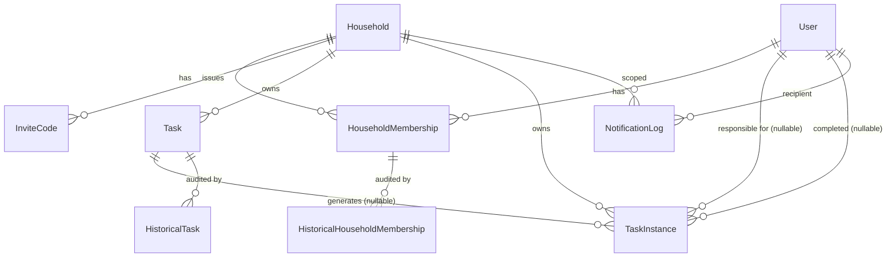

# Architecture — Shared Household Chores Tool (Django)

Companion to [plan.md](plan.md). This document describes **how** the MVP scope is built on a
Django monolith run locally via Docker Compose. It covers the runtime topology, project layout,
data model, the fairness / assignment engine, background jobs, and the cross-cutting concerns
(auth, audit, notifications, testing).

---

## 1. Tech stack

| Concern | Choice | Notes |
|---|---|---|
| Language / framework | **Python 3.12+, Django 5.x** | Batteries-included: ORM, migrations, admin, auth, forms. |
| Database | **PostgreSQL 15+** | Required for `SELECT … FOR UPDATE` (claim race), JSON fields, robust transactions. |
| Background jobs + scheduler | **Django-Q2** (`django_q`) | Single `qcluster` process; ORM broker for MVP (no Redis), Redis optional later. Built-in scheduler. |
| Audit trail | **django-simple-history** | Auto-tracks "who changed what, when" on `Task.point_value` and `HouseholdMembership.daily_capacity`. |
| Auth | **django-allauth** | Email + password, invite-code join flow layered on top. |
| Frontend | **Django templates + Bootstrap 5 + HTMX** (+ a little Alpine.js) | Server-rendered. HTMX for claim buttons, inline capacity edits, polling the task pool. No SPA. |
| Email | Django SMTP backend → **Mailpit** locally (or `console` backend) | Transactional reminders only. Swap in django-anymail + a real provider only if ever hosted publicly. |
| Static files | Django dev server (`runserver`) serves them | Add WhiteNoise only if switching `web` to gunicorn. |
| Config | **django-environ** | 12-factor env vars from `.env`; `settings/base|dev.py` split (`prod.py` only if hosted). |
| Tests | **pytest, pytest-django, factory_boy, time-machine** | See §11. |
| Local runtime | **Docker Compose** | `db` + `web` + `worker` (+ optional `mailpit`). No cloud hosting for the MVP — see §2.1. |

Everything is one codebase running as **two processes**: a web process and a worker process,
sharing the same Postgres database. Locally both are Docker Compose services.

---

## 2. Runtime topology

```
                         ┌─────────────────────────┐
   localhost:8000        │  Web process            │
  browser ─────────────▶  │  manage.py runserver    │
                         │  (Django)                │
                         └───────────┬─────────────┘
                                     │  SQL
                                     ▼
                         ┌─────────────────────────┐
                         │  PostgreSQL             │
                         │  (app data + Q broker + │
                         │   simple-history rows)  │
                         └───────────┬─────────────┘
                                     │  SQL (polls task queue + schedules)
                         ┌───────────┴─────────────┐
                         │  Worker process         │
                         │  manage.py qcluster     │
                         │  - scheduled jobs       │
                         │  - async tasks (email)  │
                         └───────────┬─────────────┘
                                     │ HTTPS API
                                     ▼
                         ┌─────────────────────────┐
                         │  Mailpit (local SMTP +   │
                         │  web inbox at :8025)     │
                         └─────────────────────────┘
```

- **Runs locally via Docker Compose** — no cloud hosting for the MVP. The same two processes are
  just two compose services against one Postgres container.
- **Redis:** not used. Django-Q2 uses the Django ORM as its broker.
- **Scale target:** dozens of households × ≤10 members. Traffic is trivial; correctness of the
  assignment math and the audit trail is what matters.

### 2.1 Docker Compose services

| Service | Command / image | Purpose |
|---|---|---|
| `db` | `postgres:16` | app data + Django-Q broker + simple-history rows; named volume for persistence |
| `web` | app image → `manage.py runserver 0.0.0.0:8000` (dev) — swap for `gunicorn config.wsgi` to mirror prod | serves the Django app on `localhost:8000` |
| `worker` | same app image → `manage.py qcluster` | scheduled jobs + async email; `depends_on: [db]` |
| `mailpit` | `axllent/mailpit` | catches outbound reminders; inbox UI on `localhost:8025`. Alternatively skip it and use `EMAIL_BACKEND = console` to log emails. |

One `Dockerfile` (Python slim + `pip install`) is shared by `web` and `worker`. Source is
bind-mounted in dev so `runserver` / `qcluster` autoreload on edit. `.env` supplies `DATABASE_URL`,
`SECRET_KEY`, `DJANGO_SETTINGS_MODULE=config.settings.dev`, and the Mailpit SMTP host/port.
Bootstrap once with `docker compose run --rm web python manage.py migrate` then
`… setup_schedules` and `… loaddata default_tasks`.

---

## 3. Django project layout

```
config/
  settings/
    base.py          # shared settings; Q_CLUSTER config lives here
    dev.py           # DEBUG, SMTP → Mailpit, Postgres from DATABASE_URL
    # prod.py        # only if ever hosted: security headers, real email, WhiteNoise
  urls.py
  wsgi.py / asgi.py

apps/
  accounts/          # custom User model, auth glue (allauth), profile
  households/         # Household, HouseholdMembership, InviteCode
                     #   join/create flows, member list, capacity editing,
                     #   activity (audit) feed
  chores/            # Task (definitions), TaskInstance (occurrences),
                     #   task pool, claim / complete views, recurrence
    services/
      recurrence.py      # generate_recurring_instances()
      assignment.py      # fairness ratios + auto-assignment engine
      rollover.py        # missed → debt transitions
    jobs.py              # thin wrappers registered with Django-Q scheduler
  notifications/     # email templates, NotificationLog, reminder jobs
  common/            # base templates, HouseholdAccessMixin, HTMX helpers,
                     #   audit rendering helpers

templates/
  base.html, partials/...
static/
manage.py
pyproject.toml
```

Four feature apps keeps boundaries clear without over-splitting. The assignment algorithm lives in
`chores/services/assignment.py` as plain functions so it can be unit-tested with no HTTP or job
machinery.

---

## 4. Data model

### 4.1 Entity-relationship overview



### 4.2 Models

**`accounts.User`** — custom user model (set from day one), email as the login identifier.
| field | type | notes |
|---|---|---|
| `email` | Email, unique | login identifier |
| `display_name` | Char | shown in the UI |
| `is_active`, `date_joined`, … | Django defaults | |

**`households.Household`**
| field | type | notes |
|---|---|---|
| `name` | Char | |
| `timezone` | Char (IANA) | e.g. `Europe/Berlin`; drives "local day" + cutoff |
| `daily_cutoff_time` | Time | local wall-clock time the auto-assignment runs (default 20:00) |
| `min_capacity` | PositiveSmallInt | floor for `daily_capacity`, default 1 (prevents ÷0) |
| `last_cutoff_run_date` | Date, null | guards the cutoff job against double runs |
| `created_by` | FK User | |
| `created_at` | DateTime | |

**`households.HouseholdMembership`** — join table + role + capacity. **History-tracked.**
| field | type | notes |
|---|---|---|
| `household` | FK | |
| `user` | FK | |
| `role` | Char choices: `admin`, `member` | creator is `admin`; only admins re-point tasks & manage invites |
| `daily_capacity` | PositiveInt | self-reported free-time number (e.g. minutes/day). **Visible to all members.** |
| `joined_at` | DateTime | |
| `is_active` | Bool | leaving a household deactivates rather than deletes (keeps history) |
| `baseline_points` | PositiveInt, default 0 | see §6.3 — seeds a new member's cumulative numerator so they aren't dumped with the whole backlog |
| — | unique_together | `(household, user)` |

`simple_history` on this model records every `daily_capacity` and `role` change with
`history_user` and `history_date` → satisfies "capacity changes logged (who, when)".

**`households.InviteCode`**
| field | type | notes |
|---|---|---|
| `household` | FK | |
| `code` | Char, unique, indexed | `secrets.token_urlsafe(8)` |
| `created_by` | FK User | admin |
| `created_at` | DateTime | |
| `expires_at` | DateTime, null | optional |
| `max_uses` | PositiveInt, null | null = unlimited |
| `uses_count` | PositiveInt, default 0 | |
| `is_active` | Bool | admin can revoke |

**`chores.Task`** — the recurring *definition* / catalog entry. **History-tracked.**
| field | type | notes |
|---|---|---|
| `household` | FK | |
| `name` | Char | |
| `description` | Text, blank | |
| `point_value` | PositiveSmallInt | current effort points; default seeded from a "common knowledge" fixture; **only admins may change** |
| `recurrence` | Char choices: `none`, `daily`, `weekly` | |
| `weekly_weekday` | SmallInt 0–6, null | required when `recurrence = weekly` |
| `default_due_date` | Date, null | used when `recurrence = none` (one-off) |
| `is_active` | Bool | inactive tasks stop generating instances |
| `created_by`, `created_at` | | |

`simple_history` on `Task` records every `point_value` change with actor + timestamp →
satisfies "point-value changes logged and visible". The in-app **Activity feed** renders these
records (`task.history.all()` + `diff_against`).

**`chores.TaskInstance`** — a concrete occurrence for one date; the thing that gets claimed,
assigned, completed, and rolled over.
| field | type | notes |
|---|---|---|
| `household` | FK | denormalised for querying |
| `task` | FK Task, null | null for ad-hoc one-offs created directly |
| `name` | Char | snapshot of the task name at generation |
| `point_value` | PositiveSmallInt | **snapshot** at generation time (see §4.3) |
| `due_date` | Date | the local date it is due |
| `original_due_date` | Date | set once at creation; unchanged by rollover |
| `status` | Char choices: `open`, `claimed`, `assigned`, `done`, `missed` | state machine, §5 |
| `responsible_user` | FK User, null | set on claim or auto-assign; stays set through `missed`/debt |
| `assignment_source` | Char choices: `claim`, `auto`, null | how `responsible_user` was set |
| `claimed_at` / `assigned_at` | DateTime, null | |
| `completed_by` | FK User, null | |
| `completed_at` | DateTime, null | |
| `is_debt` | Bool, default false | true once it has rolled past its due date unfinished |
| `days_overdue` | PositiveSmallInt, default 0 | incremented by the rollover job |
| — | unique_together | `(task, due_date)` — makes recurrence generation idempotent |
| — | index | `(household, status, due_date)`, `(household, responsible_user)` |

**`notifications.NotificationLog`** — dedup + audit for outbound reminders.
| field | type | notes |
|---|---|---|
| `household` | FK | |
| `recipient` | FK User | |
| `kind` | Char choices: `unclaimed_pool`, `overdue` | |
| `task_instance` | FK, null | |
| `sent_at` | DateTime | |
| — | index | `(recipient, kind, sent_at)` — "did we already nudge them today?" |

### 4.3 Key modelling decisions

1. **`Task` vs `TaskInstance` split.** Definitions are stable and admin-governed; occurrences are
   per-day, mutable, and carry the assignment/completion lifecycle. This keeps the audit history on
   `Task` small and meaningful.
2. **Points are snapshotted onto each `TaskInstance` at generation.** Rationale: the fairness
   numerator must be stable and reproducible; an admin re-pointing "Clean bathroom" from 3→5 should
   not silently rewrite yesterday's ratios. Trade-off: today's already-generated open instance keeps
   the old value. Mitigation: the admin re-point form offers a checkbox "also apply to today's open
   instances". Completed instances keep their awarded points permanently.
3. **Rollover mutates the same row**, it does not clone. A missed instance stays as one
   `TaskInstance` with `status = missed`, `is_debt = true`, `days_overdue += 1`, and keeps its
   `responsible_user`. "Debt" = `TaskInstance.objects.filter(responsible_user=u, is_debt=True,
   status__in=['missed','assigned','claimed'])`. It clears only when `status → done`.
4. **Leaving a household deactivates** the membership (`is_active = False`) rather than deleting it,
   so history rows and past instances keep their foreign keys.
5. **`Household.timezone`** is authoritative for "what day is it" and when the cutoff fires. All
   stored datetimes are UTC (`USE_TZ = True`).

---

## 5. Task-instance state machine

```
                 claim (member)                complete
   ┌────────┐ ───────────────▶ ┌─────────┐ ───────────────▶ ┌──────┐
   │  open  │                  │ claimed │                  │ done │
   └────┬───┘ ◀─────────────── └────┬────┘   (also from     └──────┘
        │        unclaim            │         assigned, missed)
        │  daily cutoff:            │  cutoff passes, not done
        │  auto-assign              ▼
        │                     ┌─────────┐  cutoff passes, not done   ┌────────┐
        └───────────────────▶ │assigned │ ─────────────────────────▶ │ missed │
          (lowest ratio)      └─────────┘                            │(is_debt│
                                                                     │ =true) │
                                    complete from any non-done state └───┬────┘
                                    ▶ done                               │ still not done
                                                                         │ at next cutoff
                                                                         ▼ days_overdue++ (stays 'missed')
```

- `open → claimed`: transactional, first-come-first-served (§7).
- `claimed → open`: a member may release a claim before the cutoff.
- `open → assigned`: only the daily-cutoff job, to the lowest-ratio member.
- `claimed|assigned → missed`: the rollover step of the next cutoff, if not `done`.
- `* → done`: `mark_as_done` from `claimed`, `assigned`, or `missed`; sets `completed_by/at`,
  clears `is_debt`.

---

## 6. Fairness & assignment engine

`apps/chores/services/assignment.py` — pure functions, no Django views or jobs.

### 6.1 The ratio

```
ratio(user) = (baseline_points + Σ point_value of every TaskInstance the user is
               responsible for, any status) ÷ max(daily_capacity, household.min_capacity)
```

- **Rolling / cumulative** — the numerator is a lifetime sum for that membership; nothing resets
  weekly. The metric is only ever used *comparatively* ("who has the lowest ratio"), so its absolute
  growth over time is harmless.
- **Assigned, not completed** — a missed task still counts in the numerator because it was still put
  on that person. (Open question flagged in §12: should chronic non-completion be penalised or
  relieved?)
- **`min_capacity`** guards against divide-by-zero and absurd lowballing to 0.

```python
def household_ratios(household) -> dict[int, Decimal]:
    """user_id -> current fairness ratio, for every active member."""

def assign_open_instances(household, *, now) -> list[TaskInstance]:
    """
    Greedy, deterministic:
      open = instances(status=open, due_date<=local_today) locked FOR UPDATE
      totals = {user_id: numerator}         # from household_ratios internals
      for inst in sorted(open, by -point_value, then id):
          pick user = argmin( (totals[u] + inst.point_value) / capacity[u] )
          tie-break: fewest instances assigned so far this run, then user_id
          inst.status='assigned'; inst.responsible_user=user
          inst.assignment_source='auto'; inst.assigned_at=now
          totals[user] += inst.point_value
    """
```

### 6.2 Daily cutoff job (per household)

`run_daily_cutoff(household_id)` inside one `transaction.atomic()`:

1. Resolve `local_today` from `household.timezone`. Bail if `last_cutoff_run_date == local_today`
   (idempotent / safe to retry).
2. **Rollover:** every `TaskInstance` with `due_date < local_today` and `status in
   {open, claimed, assigned}` → `status = missed`, `is_debt = True`, `days_overdue += 1`.
   (`open` ones that were never claimed get `responsible_user` assigned here too, via the same
   lowest-ratio pick, so unclaimed debt still has an owner.)
3. **Auto-assign today:** `assign_open_instances(household, now=now)` for `due_date == local_today`,
   `status = open`.
4. Set `household.last_cutoff_run_date = local_today`.
5. Enqueue overdue + newly-assigned notification tasks (async, outside the lock).

### 6.3 New-member fairness

A member who joins mid-stream has numerator 0 → ratio 0 → the engine would dump every unclaimed
task on them until they "catch up". `baseline_points` seeds their numerator at join time to
`round(median(existing members' ratios) × their daily_capacity)` so they start near parity. This is
a one-time write, itself recorded via simple-history. Flagged as tunable in §12.

---

## 7. Concurrency — claim-first correctness

The only real race in the system is two members claiming the same `open` instance.

```python
# apps/chores/views.py  (POST /h/<hid>/pool/<instance_id>/claim)
with transaction.atomic():
    inst = (TaskInstance.objects
            .select_for_update()
            .get(pk=instance_id, household_id=hid))
    if inst.status != "open":
        # someone won the race, or it was auto-assigned
        return HttpResponse(status=409)  # HTMX swaps in "already taken"
    inst.status = "claimed"
    inst.responsible_user = request.user
    inst.assignment_source = "claim"
    inst.claimed_at = timezone.now()
    inst.save(update_fields=[...])
```

- `select_for_update()` + Postgres row lock ⇒ the second transaction blocks, then sees
  `status != "open"` and loses cleanly.
- The daily-cutoff job takes the same locks, so a claim landing exactly at cutoff either wins
  before the job or is skipped by it.
- HTMX response: success swaps the row into "My Tasks"; 409 re-renders the pool partial.

---

## 8. Background jobs & scheduling

One worker: `python manage.py qcluster`. Schedules are created once via a data migration / a
`manage.py setup_schedules` command, stored in `django_q.Schedule`.

| Job | Cadence | What it does |
|---|---|---|
| `generate_recurring_instances` | every day 00:10 UTC **and** hourly (cheap, idempotent) | For each active household: for its `local_today`, create one `TaskInstance` per active `daily` task and per `weekly` task whose `weekly_weekday` matches. `unique_together(task, due_date)` makes re-runs no-ops. |
| `run_cutoffs_due` | every 15 min | For each household where `now(local)` has passed `daily_cutoff_time` and `last_cutoff_run_date < local_today`: call `run_daily_cutoff(household_id)`. This "poll + guard" pattern avoids maintaining N per-household cron entries. |
| `send_pool_reminders` | daily, a few hours before the typical cutoff (e.g. 16:00 UTC) | Email members if their household still has `open` instances today and they have not been nudged today (`NotificationLog`). |
| `send_overdue_reminders` | daily 09:00 UTC | Email each member their `is_debt` list if non-empty and not already sent today. |
| `django_q` housekeeping | built-in | `Q_CLUSTER['save_limit']` caps stored results. |

All jobs are **idempotent** and **safe to retry** — they re-derive state from the DB and guard with
date checks, so a missed worker window self-heals on the next tick.

Async (not scheduled) tasks: sending individual emails is pushed onto the queue by request handlers
and by the cutoff job (`async_task("notifications.jobs.send_email", ...)`) so the web request never
blocks on SMTP.

---

## 9. Auth, households & permissions

- **django-allauth** for signup / login / password reset (email + password; email verification
  optional for MVP — see §12).
- **Create household:** any logged-in user; becomes `admin`, gets a starter `InviteCode` and a
  fixture set of common tasks with default points.
- **Join household:** `POST /join` with an invite code →
  validate (`is_active`, not expired, `uses_count < max_uses`) → create `HouseholdMembership`
  (`role=member`, `daily_capacity` prompted on next screen) → `uses_count += 1`.
- **Multiple memberships** are allowed. URLs are household-scoped: `/h/<household_id>/…`. A
  `HouseholdAccessMixin` (in `apps/common`) resolves the membership for `request.user` +
  `household_id` on every view, 404s if absent, and stashes `request.membership`.
- **Role gate:** an `AdminRequiredMixin` checks `request.membership.role == "admin"` for:
  editing `Task.point_value`, creating/deactivating tasks, managing invite codes, changing another
  member's role.
- **Never trust `household_id` from a form body** — it always comes from the URL and is
  re-validated against membership.
- **Django admin** (`/admin`) is staff-only and used for support/debugging, not day-to-day
  governance. It exposes simple-history inlines for `Task` and `HouseholdMembership`.

---

## 10. Frontend

Server-rendered Django templates, **Bootstrap 5** (CDN), **HTMX** for partial updates, a sprinkle
of **Alpine.js** for pure-client toggles. No build step, no SPA.

| Page | Route | Notes |
|---|---|---|
| Dashboard | `/h/<hid>/` | Per-member table: cumulative points, capacity, ratio, today's status, debt count. |
| Task pool | `/h/<hid>/pool/` | `open` instances with **Claim** buttons. Partial auto-refreshes via `hx-trigger="every 15s"` — good enough for ≤10 users, no websockets. |
| My tasks | `/h/<hid>/me/` | Today's claimed/assigned + a distinct **Debt** section. **Mark done** buttons. |
| Tasks catalog | `/h/<hid>/tasks/` | List + create. Point-value field is disabled for non-admins; admin edit form shows current history inline. |
| Members & capacity | `/h/<hid>/members/` | Everyone's capacity (visible to all). Inline edit for *your own* via HTMX; each save writes a history row. |
| Activity log | `/h/<hid>/activity/` | Unified feed from `Task.history` + `HouseholdMembership.history`: "Alex changed *Clean bathroom* 3 → 5 pts · Sep 5, 19:12". |
| Household settings | `/h/<hid>/settings/` | Admin: name, timezone, cutoff time, `min_capacity`, invite codes. |
| Create / Join | `/create`, `/join` | |

HTMX + CSRF: `hx-headers='{"X-CSRFToken": "…"}'` set once on `<body>`.

---

## 11. Testing strategy

`pytest` + `pytest-django` + `factory_boy` + `time-machine`.

- **Unit — assignment engine** (`assignment.py`): given fixed capacities and assigned-point totals,
  assert the exact pick order and tie-breaks. Table-driven.
- **Unit — ratio math:** divide-by-zero guard, `baseline_points`, missed tasks counted.
- **Unit — recurrence:** `generate_recurring_instances` on a frozen date creates the right rows;
  a second run creates nothing (idempotency via `unique_together`).
- **Unit — rollover:** `open/claimed/assigned` before `local_today` → `missed + is_debt`,
  `days_overdue` increments; `done` untouched; debt clears on completion.
- **Concurrency:** two `TransactionTestCase` threads claim the same instance → exactly one 200,
  one 409.
- **Cutoff idempotency:** running `run_daily_cutoff` twice for the same local date is a no-op the
  second time.
- **Permissions:** non-admin `POST` to the re-point endpoint → 403; a member of household A cannot
  load `/h/<B>/…` (404).
- **Audit:** editing `Task.point_value` and `daily_capacity` creates history rows with the correct
  `history_user`.
- **Flows:** invite-code join happy path + expired/maxed-out/revoked codes.
- Time-dependent tests pin the clock with `time_machine.travel`.

CI: GitHub Actions — `ruff` + `mypy` (optional) + `pytest` against a Postgres service container.

---

## 12. Open questions / tunable decisions

Carried from [plan.md](plan.md) §"Riskiest Assumption" plus modelling choices above:

1. **Do missed tasks stay in the fairness numerator?** Current design: yes (they were assigned).
   Alternative: move debt into a separate term so chronic non-completion doesn't *lower* future
   auto-assignment. Needs a product call.
2. **New-member seeding (`baseline_points`).** Median-ratio seed is a guess; may want "start at 0"
   for small/new households or an admin-set value.
3. **Point snapshot vs live.** Snapshot chosen for reproducibility; confirm the "apply to today's
   open instances" checkbox is enough for admins correcting a bad default.
4. **Cutoff granularity.** 15-min polling means the effective cutoff is `time ± 15 min`. Fine for
   chores; tighten the poll if not.
5. **Email verification on signup.** Deferred for MVP friction; revisit before any real household
   uses it.
6. **Capacity units.** Plan says "a single number, e.g. minutes/day" — the tool stays unit-agnostic
   (just an integer) and the household agrees on meaning socially, matching the points philosophy.
7. **Timezone per household vs per member.** MVP: per household. Travelling members are out of
   scope (v2 vacation handling).

---

## 13. Milestone slice for build order

1. **Skeleton:** Docker Compose (`db`+`web`+`worker`+`mailpit`), Dockerfile, project, custom `User`, allauth, base template, `migrate`.
2. **Households:** create / invite / join, membership, roles, capacity field (+ history).
3. **Tasks:** `Task` CRUD, default-points fixture, admin re-point + history, Activity feed.
4. **Instances & pool:** `generate_recurring_instances`, pool page, transactional claim, mark-done.
5. **Assignment engine:** `assignment.py` + tests, then `run_daily_cutoff` + `run_cutoffs_due`.
6. **Rollover & debt:** rollover step, My Tasks debt section, dashboard ratios.
7. **Reminders:** `NotificationLog`, pool + overdue email jobs, SMTP → Mailpit wiring.
8. **Polish:** empty states, HTMX pool refresh, settings page, CI green.
